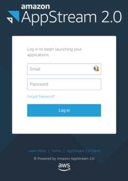
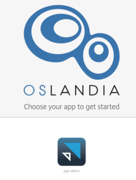
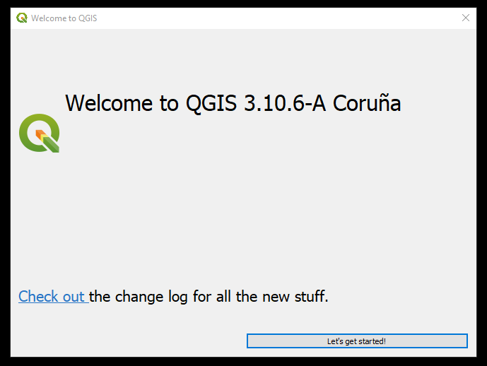
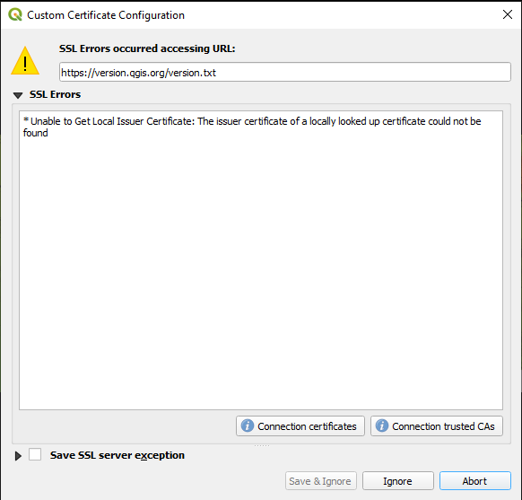
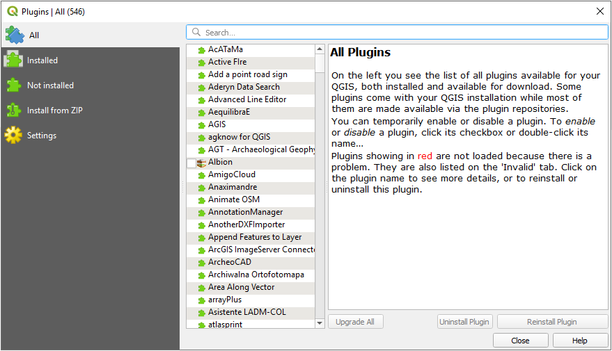
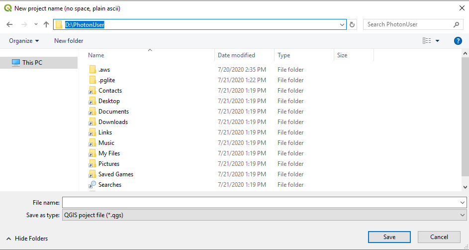
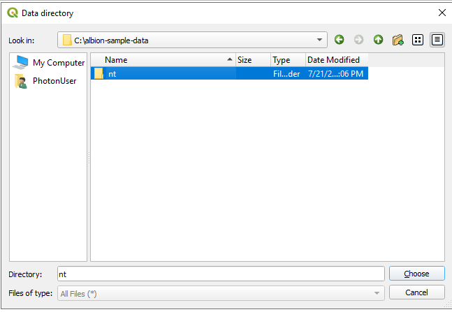
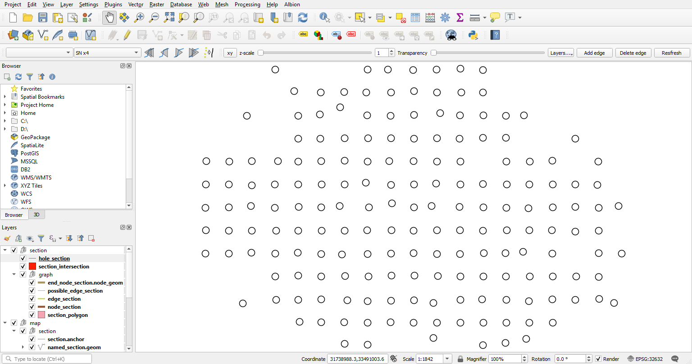

# Accès distant à Albion dans Amazon AppStream

Cette documentation permet de tester l'application Albion dans un environnement **distant** et pleinement **fonctionnel**, pourvu de l'ensemble des données permettant [de dérouler le tutoriel](https://oslandia.gitlab.io/albion_doc/)

## Connexion

Une fois le mail d'invitation reçu, veuillez vous connecter avec le mot de passe fourni ; il faut ensuite le modifier.

  
  
Choisir l'app Qgis :

  

## Démarrage QGis

L'application QGis démarre , cliquez sur *Let's get started*

Une fenêtre de sécurité SSL s'ouvre , cocher la case `Save SSL server exception` et cliquer sur `Save & ignore`.

Dans le menu choisir `Plugins` puis `Manage and install plugins`. Dans la fenêtre suivante, cocher la case devant le plugin *Albion* pour valider l'installation. Une fenêtre noire s'ouvre, attendre qu'elle se ferme d'elle même et cliquer sur `Close`.

## Nouveau projet 

Créer un nouveau projet Ablion :

* dans le menu choisir *Albion* puis *New project*. 
* dans la fenêtre de sélection de fichier qui s'ouvre, taper le chemin `D:\\PhotonUser` dans la barre en haut puis saisir un nom de projet dans la barre en bas, enfin cliquer sur `Save`. 
* une nouvelle petite fenêtre s'ouvre avec le SRID à utiliser, cliquer sur `OK`.
* attendre la fin de création du projet (~ 20 secondes; plus de barres bleues).

Importer les données d'exemple qui vont avec le [tutoriel](https://oslandia.gitlab.io/albion_doc/) : 

* dans le menu `Albion`, choisir `Import directory`
* dans la fenêtre de sélection de fichier qui s'ouvre, taper le chemin `c:\\albion-sample-data` et choisir le répertoire *nt* (sans l'ouvrir) 
  

* cliquer sur `Choose`
* vous devez obtenir la visualisation des couches :

