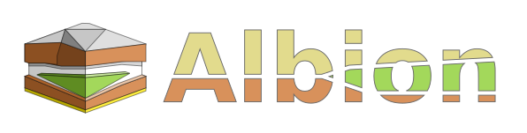
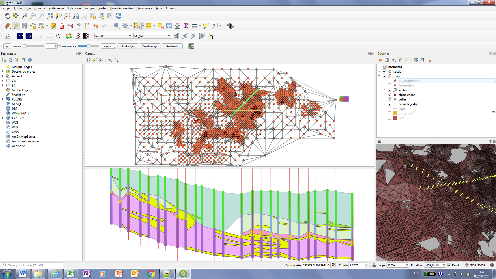
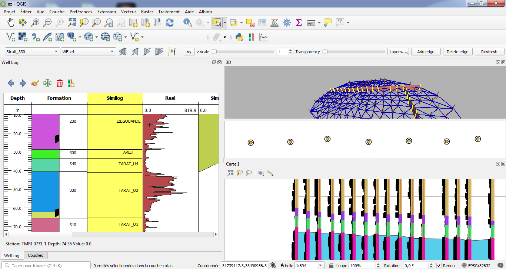
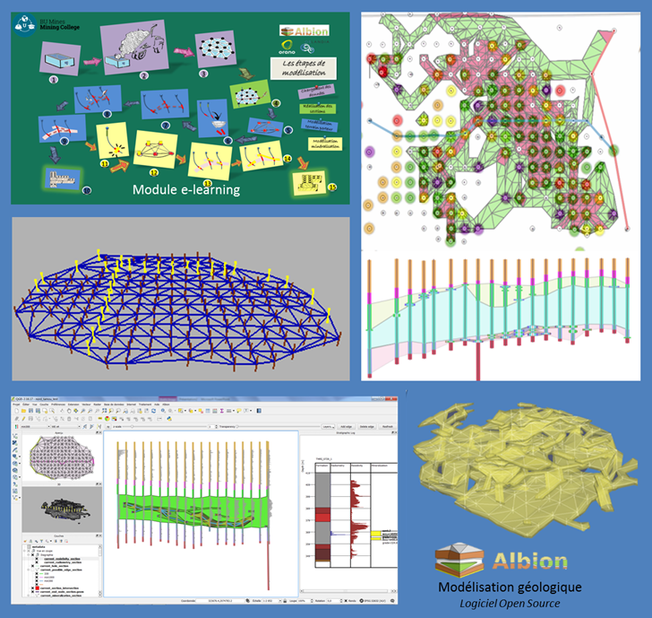

# Build 3D geological model from wells information

## What is Albion ?

This [QGIS](http://qgis.org) plugin provides tools to **create 3D geological models in QGIS**, from borehole information.

Features :
- Edition of Cross-sections (see video above)
- 3D Volume reconstruction from cross-sections
- 3D Volume edition
- 2D Visualization
  - All geological 2D layers
  - Additional GIS data ( orthophotos/satellite, maps, geological maps..)
  - Boreholes
  - Cross sections
- 3D visualization
  - Boreholes
  - Volume

It uses an innovative method of modeling stratigraphic layers in the form of a graph to facilitate volumetric reconstruction, and requires few user intervention. It allows geologists to perform underground modeling in 6 times less time than with previously used tools. A video [shows how it may be used](https://vimeo.com/326854657). 

And [this video by Vincent Mora explains **the founding concepts of Albion**](https://vimeo.com/328677023).

## Documentation

- Here is [a quick install doc](quick_dev_install.md) 
- here is [a full tutorial](https://oslandia.gitlab.io/albion_doc/) (in french)
- [the source of the documentation](https://gitlab.com/Oslandia/albion_doc) has its own repository

## Screenshots

Some screenshots of the main interface, including 3D rendering : 

## Testing Albion

You can [contact us](mailto:infos@oslandia.com) in order to **test Albion within an Appstream application**. The documentation [is here](https://gitlab.com/Oslandia/albion/-/tree/master/doc_appstream).